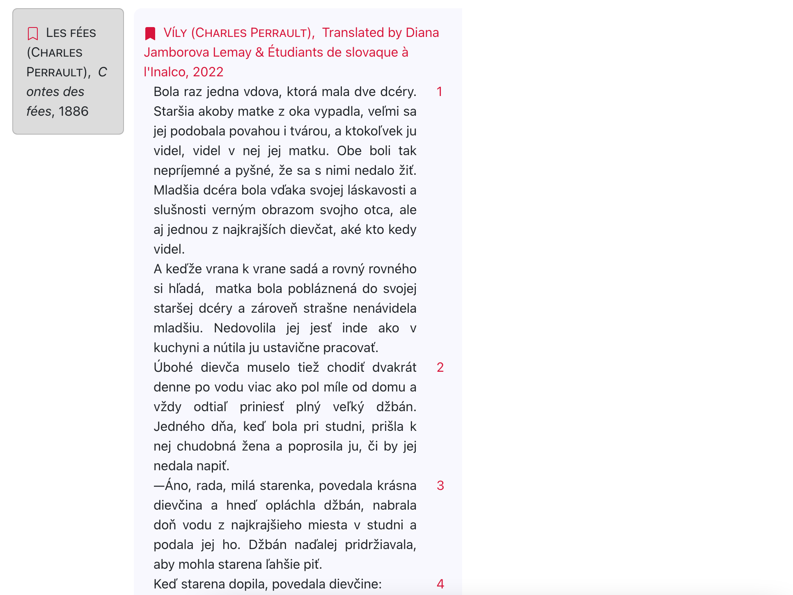
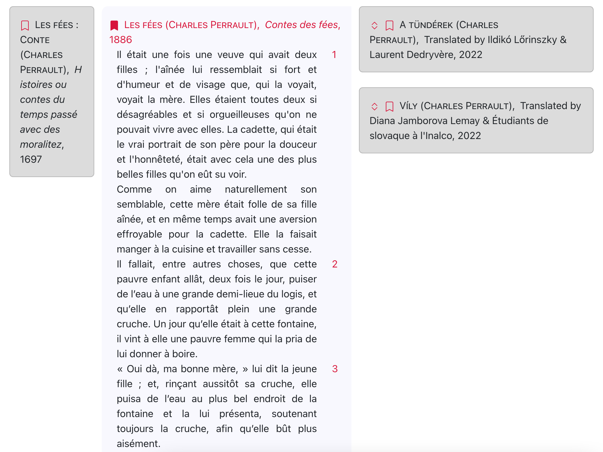
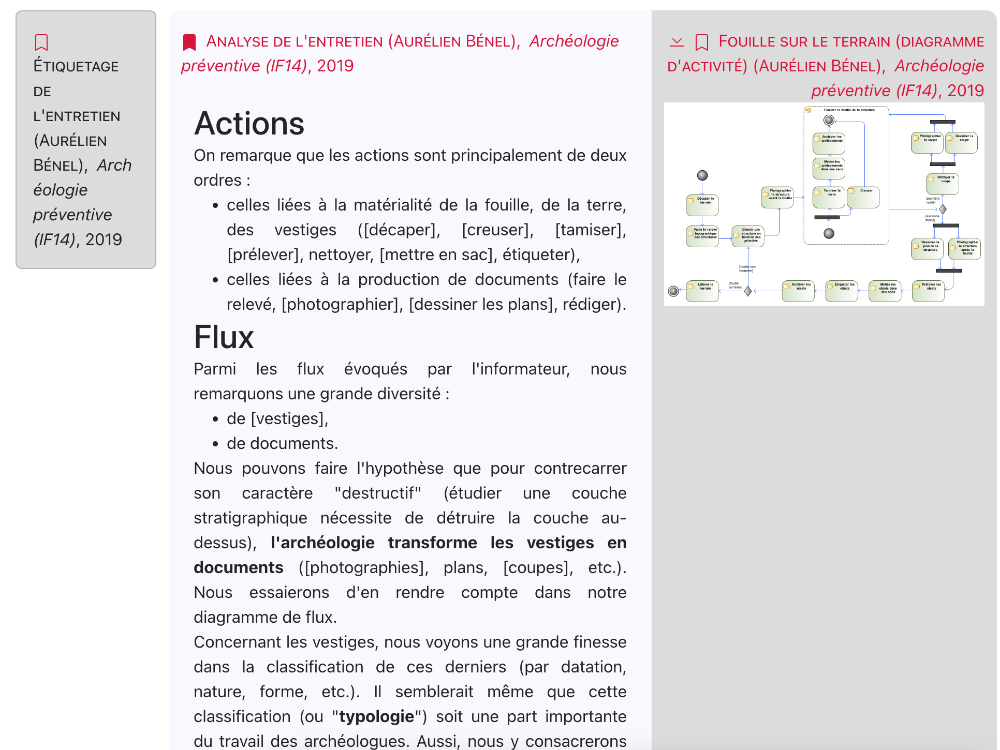
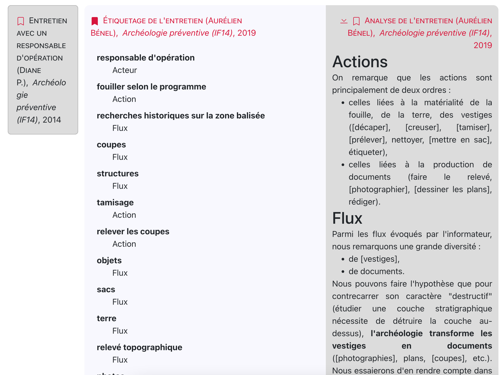
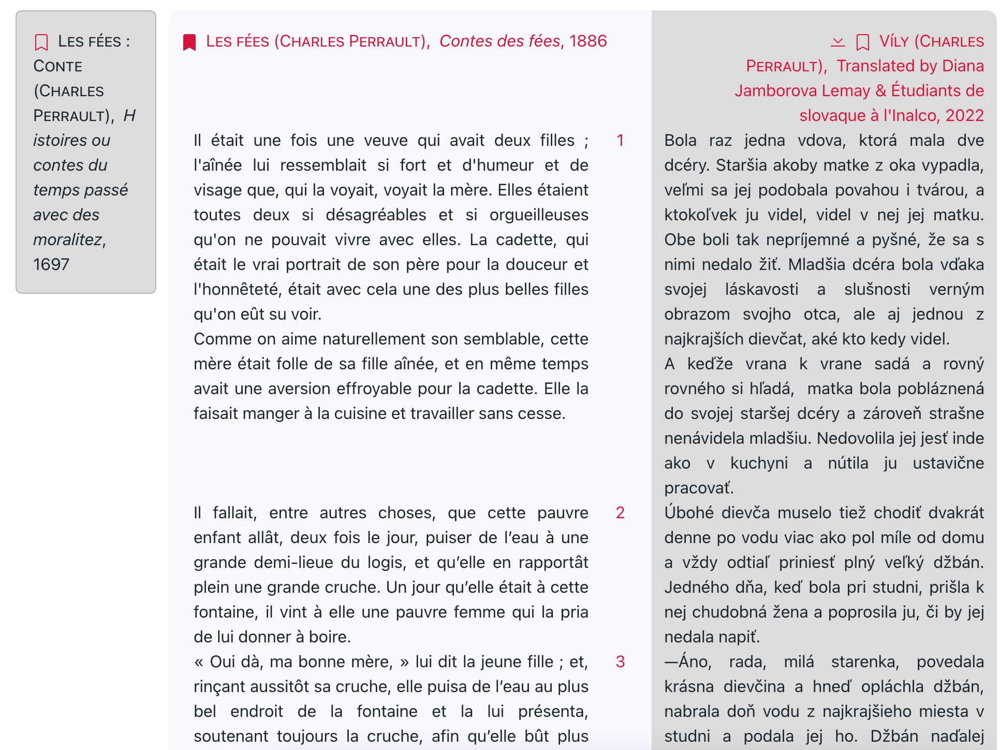
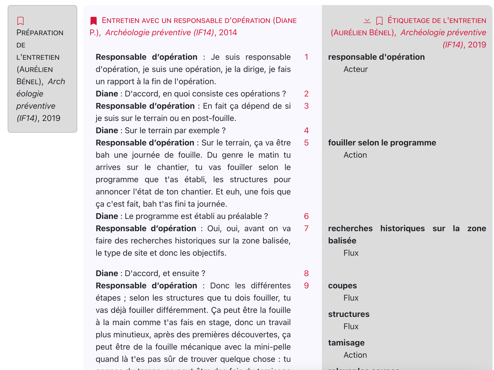
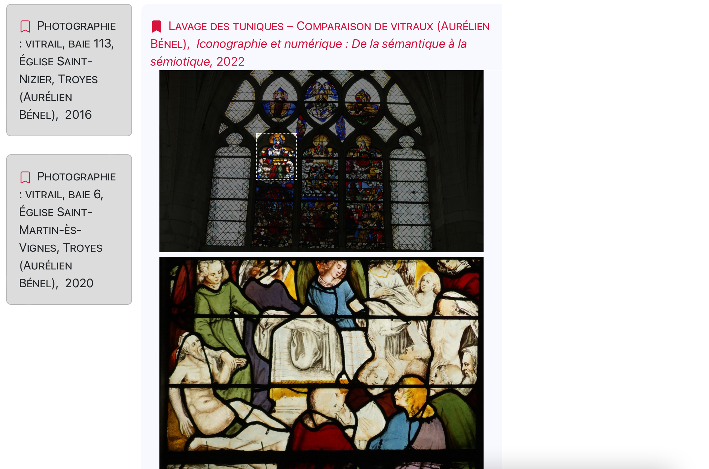
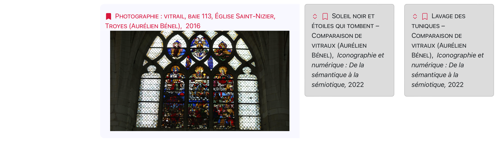

# HyperGlosae: A Nelsonian[^1] hypertext infrastructure for digital humanities

## Vision

[Hypertexts as envisioned by Theodor Nelson in the 1960's](https://www.youtube.com/watch?v=hMKy52Intac) are "needed more than ever", hypertexts with links that can be:

- followed both ways (e.g. from a comment to the original and from the original to comments),
- created freely by any reader (without validation by the author or the organization hosting the original document),
- used to read linked documents side by side, with related fragments in parallel,
- used to quote, explain, translate an existing document or fragment in a new one, or to compare two existing documents.

Because of the Web scale and because of the gap between Web usage and the tradition of Humanities that inspired Theodor Nelson, rebuilding the Web on these bases are probably out of reach for most of people and organizations.
However, existing communities of "humanists" share the same epistemological and methodological tradition.
We think they are both willing and able to adopt such an infrastructure.

[^1]: Disclaimer: We are not affiliated with Theodor Nelson. We are just fans ;)

## Scope

Step by step, we will prototype such an infrastructure and will test it on prior documented practices of "parallel documents" in our existing Hypertopic software suite (esp. [TraduXio](https://hypertopic.org/traduxio) and [Cassandre](https://hypertopic.org/cassandre)).

## Requirements

HyperGlosae will be designed with environmental responsibility in mind (for example the number and weight of HTTP requests will be kept low).

## Architecture

Bidirectional links cannot be distributed as easily as unidirectional links.
If the frontend was the origin of every request (as on the Web), getting all bidirectional links to a given document would require every backend (that may store one) to be queried...
Instead, the original hypertext architecture was more like a federation of backends (a bit like Usenet).
A modern version of this (see figure below) will be achieved with CouchDB filtered replications.

 with current technologies (React and CouchDB).")

## "Literature" model

The concept of *literature* (*e.g.* "scientific literature") is that *reading* a document results in *writing* new ones (highlights, annotations, analyses, translations, critics, etc.).
Hence the meaning of a document is indeed in the whole graph of direct or indirect sources and offsprings.

### Forward links


A *forward link* is similar to a bibliographical reference: because a document (in the center) has been written after reading a prior document (on the left margin), it refers to it.

In this hypertext system, contrary to the Web:
- the reference of the link does not depend of a host (see [format](https://github.com/Hypertopic/HyperGlosae/blob/47e401e57c62756edfbdedb3172e49f87f18b532/samples/perrault_jamborova.json#L11-L12)),
- the system resolves the identifier and gets bibliographical data (see [format](https://github.com/Hypertopic/HyperGlosae/blob/47e401e57c62756edfbdedb3172e49f87f18b532/samples/perrault_1886.json#L2-L7)).

### Reverse links


A "reverse link" is the virtual one going from a document to a document that refers to it.
Consulting (on the right margin) the different translations, commentaries, analyses of a given source (in the center) has deep philosophical and political perspectives: each derived document can be seen as a different *point of view* on the document, attested by a specific author at a given date.

Contrary to this hypertext system, the Web has no built-in features to compute and display "reverse links" but, for example, such a computation is handled for the Web globally by Google Search (to compute *PageRank*), and locally by certain blog or wiki software.

### Side-by-side linked documents




Opening one of the reverse links, side by side with its source, is like reviving the moment when the author of the derived document read the source and started to write in the margin, creating a new document.

### Side-by-side parallel documents




Translations, *scholia* (comments on a term), qualitative analysis "codes", are typical *parallel linked documents* of a source.
It means that every part of the derived document is linked to a specific part of the source document, using:
- a mandatory *rubric*, *i.e.* the "red-printed" identifier of a passage (see [format](https://github.com/Hypertopic/HyperGlosae/blob/47e401e57c62756edfbdedb3172e49f87f18b532/samples/perrault_jamborova03.json#L8)), already defined in the source (see [format](https://github.com/Hypertopic/HyperGlosae/blob/47e401e57c62756edfbdedb3172e49f87f18b532/samples/perrault_1886_content.json#L4)), and that follows the same order as the passages,
- an optional quote from this passage (see [format](https://github.com/Hypertopic/HyperGlosae/blob/6a1b4a56dea8d3d0fb2a3de3e49d972c503b3848/samples/inrap_D0.json#L12) and commit message).

### Transclusion (inclusion by reference)



A new document can be made by *transcluding* (i.e. "virtually including") the content of existing documents or parts of them (see [format](https://github.com/Hypertopic/HyperGlosae/blob/92a029c3a5e636769243d571ef977a5505e5a7b3/samples/revelation_stars.json#L9-L19)).

The resulting collection can be used to compare documents (e.g. related works of art, alternative translations, etc.).
It can also be used to present selected documents to an audience in a meaningful order (chronological, narrative, argumentative, etc.).

Because transclusion is also a *link*:
- bibliographical data from sources are displayed with the derived document,
- collections based on the same document appear as *reverse links*.



## Deliverables

The folders of the repository will correspond to the main deliverables:

- `samples` of parallel documents, meaningful for stakeholders of our existing software,
- `features` specification through usage scenarios,
- `frontend` prototype for reading and writing parallel documents (see instructions for [testing it](./frontend/CONTRIBUTING.md)),
- `backend` prototype for storing parallel documents (see instructions for [testing it](./backend/CONTRIBUTING.md)),
- `library` of reusable parts to be integrated in other frontends.

## Testing the latest version

Run the following commands from a terminal:

```shell
cd frontend
npm run build
cd ..
docker compose --file docker-compose.test.yml up --detach
```

Open <http://localhost> in a browser.
To test edit features, log in as user `alice` with `whiterabbit` as the password.

## Using the latest version in production

Run the following commands from a terminal:

```shell
export COUCHDB_USER="TO_BE_CHANGED"
export COUCHDB_PASSWORD="TO_BE_CHANGED"
docker compose up --detach
```

Open <http://localhost> in a browser.

