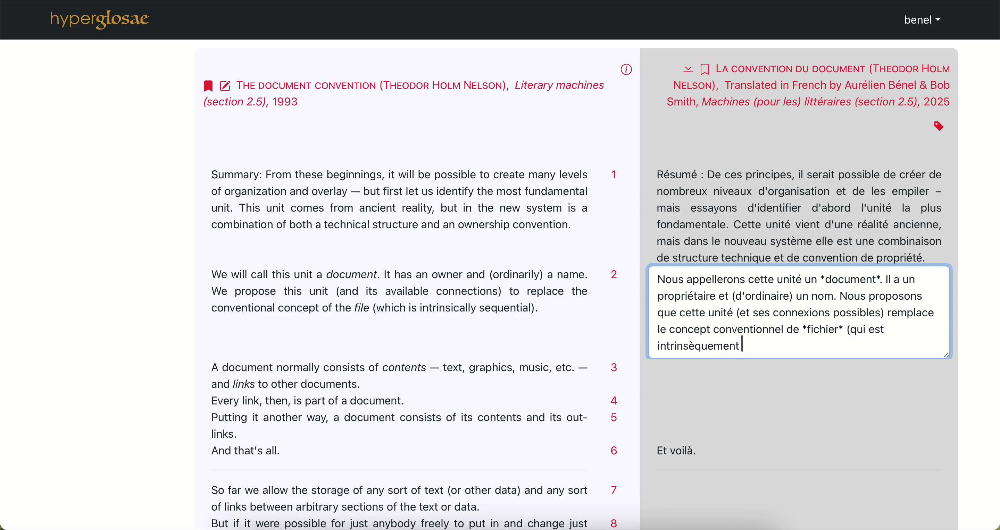
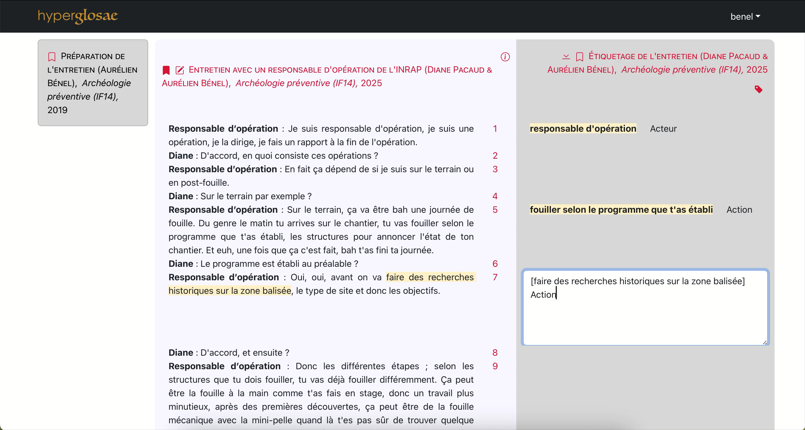
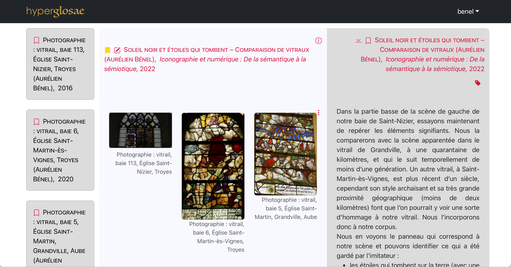
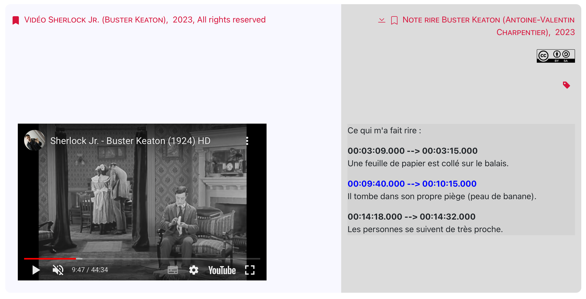
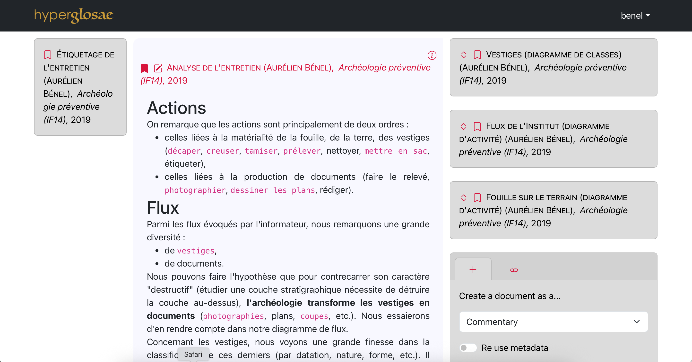
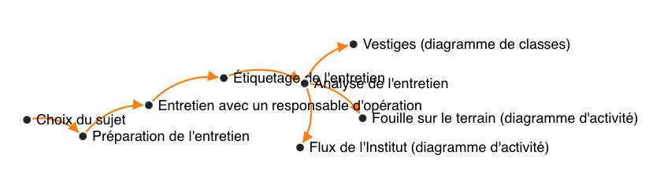

# Hyperglosae: Human annotations for digital humanities

## Product vision

__For__ intellectual workers 
__who__ interpret documents 
Hyperglosae __is a__ digital margin 
__that allows__ writing glosses (comments, adaptations or quotes) of these documents for future readers.

__Unlike__ *Hypothes.is*, *Google Docs*, *Hypotheses* (based on *WordPress*), *Zotero*, and *LiquidText*, 
__our product allows__ glossing an author-defined "passage" (*i.e.* a meaningful unit, like a paragraph, a strophe, a verse...).

__Unlike__ *Hypotheses*, 
__our product also allows__ commenting on a reader-defined "fragment".

__Unlike__  *Hypothes.is* and *Google Docs*, 
fragments __may be__ defined on a picture.

__Unlike__ all of the previously cited software, 
fragments __may even be__ defined on a video.

__Unlike__ *Hypothes.is*, *Google Docs*, and *Zotero*, 
__our product allows__ glosses to be full-fledged documents and hence to be glossed as well. 
__It allows__ navigating from gloss to gloss, or from source to source.

## Project background

In the past decades, we designed *[Cassandre](https://hypertopic.org/cassandre)* for ethnographic studies and *[TraduXio](https://hypertopic.org/traduxio)* for translation studies. 
It appeared that both pieces of software were kind of implementations of "[parallel documents with a visible connection](https://www.youtube.com/watch?v=hMKy52Intac)" as envisioned by Theodor Nelson, who coined the term "hypertext".
We then figured out that a more general Nelsonian[^1] hypertext could be the missing infrastructure for "digital humanists".

[^1]: Disclaimer: We are not affiliated with Theodor Nelson. We are just fans ;)

Step by step, we will prototype such an infrastructure and test it on practices in social and human sciences.

## Getting Started

To run this project locally for development:

1. Clone the repository: `git clone https://github.com/hyperglosae/hyperglosae.git`
2. Install dependencies: `npm install`
3. Start the development server: `npm start`

## Requirements

HyperGlosae will be designed with environmental responsibility in mind (for example the number and weight of HTTP requests will be kept low).

## Architecture

Bidirectional links cannot be distributed as easily as unidirectional links.
If the frontend was the origin of every request (as on the Web), getting all bidirectional links to a given