# Components structure

Hyperglosae frontend is composed of the following React components:

## Bookshelf

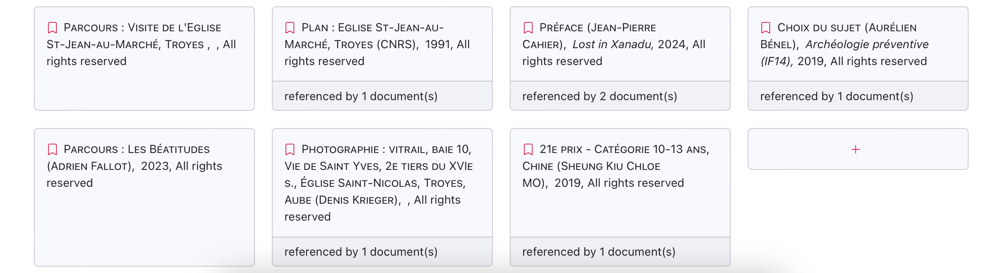

Source: [routes/Bookshelf.js](https://github.com/Hypertopic/HyperGlosae/blob/main/frontend/src/routes/Bookshelf.js)

Parts:

- Graph
- [FutureDocument](#futuredocument)

## Lectern

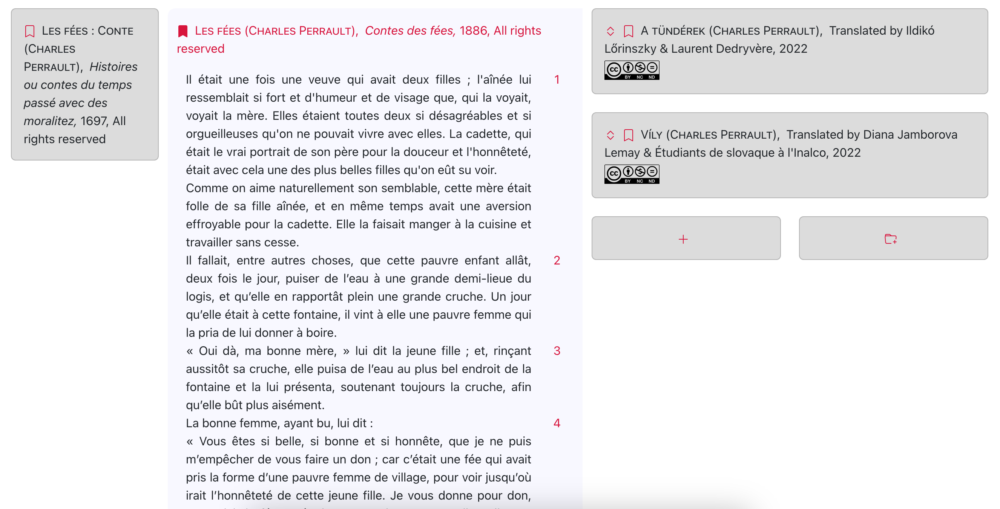
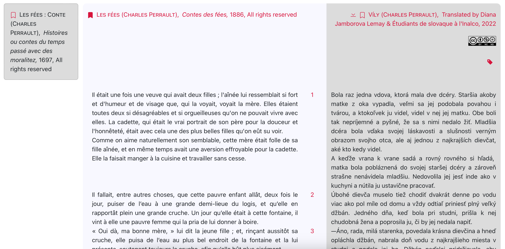

Source: [routes/Lectern.js](https://github.com/Hypertopic/HyperGlosae/blob/main/frontend/src/routes/Lectern.js)

Parts:

- [DocumentsCards](#documentscards)
- [OpenedDocuments](#openeddocuments)

## DocumentsCards

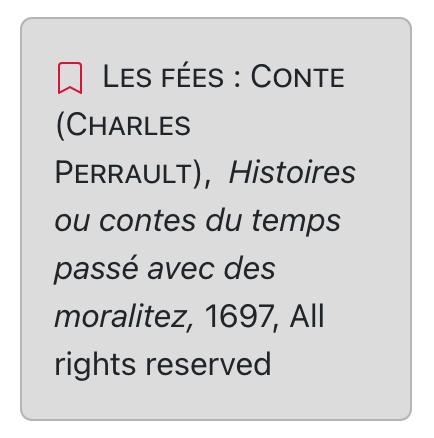
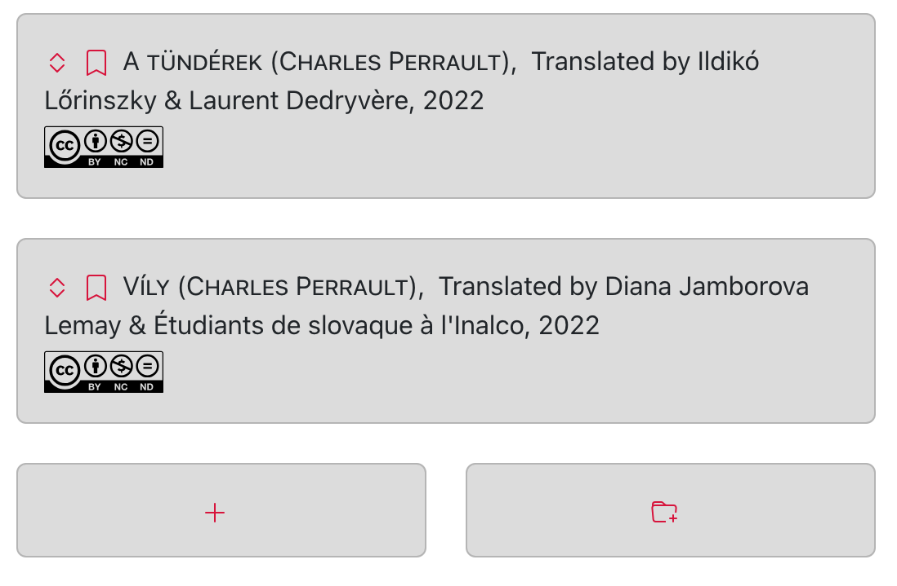

Source: [components/DocumentsCards.js](https://github.com/Hypertopic/HyperGlosae/blob/main/frontend/src/components/DocumentsCards.js)

Parts:

- [BrowseTools](#browsetools)
- [Metadata](#metadata)
- TypeBadge
- [FutureDocument](#futuredocument)

## OpenedDocuments

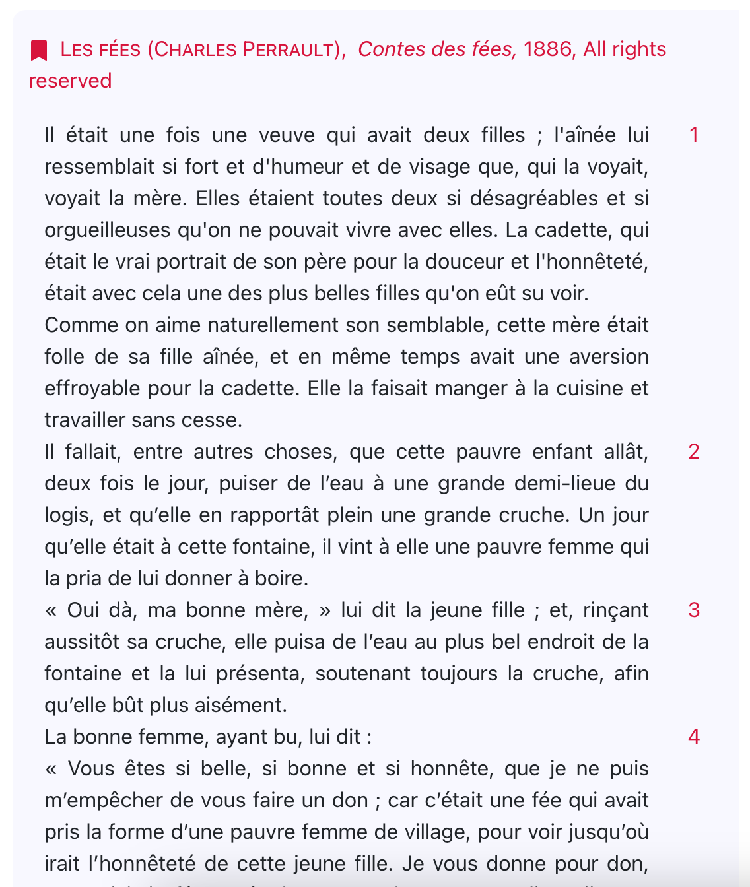
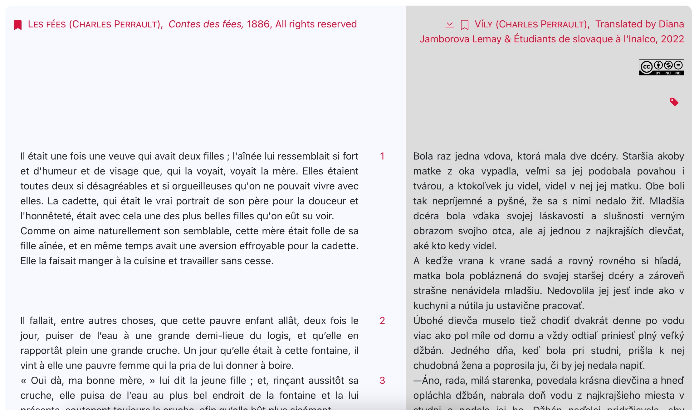

Source: [components/OpenedDocuments.js](https://github.com/Hypertopic/HyperGlosae/blob/main/frontend/src/components/OpenedDocuments.js)

Parts:

- [BrowseTools](#browsetools)
- [Metadata](#metadata)
- TypeBadge
- Type
- [Passage](#passage)

## BrowseTools

Source: [components/BrowseTools.js](https://github.com/Hypertopic/HyperGlosae/blob/main/frontend/src/components/BrowseTools.js)

Parts: **none**

## Metadata

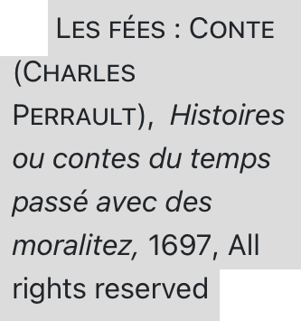

Source: [components/Metadata.js](https://github.com/Hypertopic/HyperGlosae/blob/main/frontend/src/components/Metadata.js)

Parts: **none**

## FutureDocument

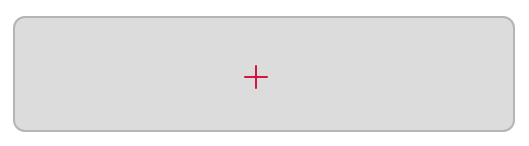
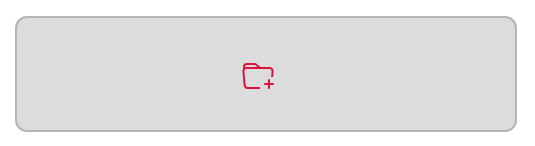

Source: [components/FutureDocument.js](https://github.com/Hypertopic/HyperGlosae/blob/main/frontend/src/components/FutureDocument.js)

Parts: **none**

## Passage

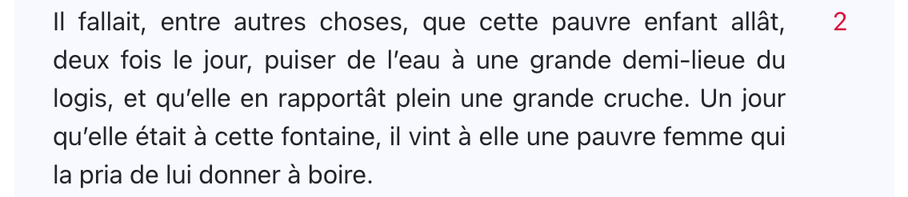
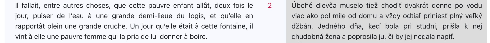
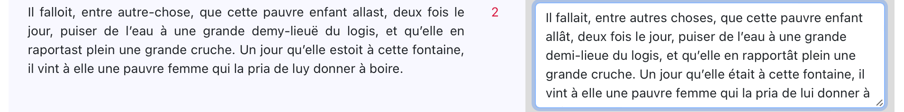

Source: [components/Passage.js](https://github.com/Hypertopic/HyperGlosae/blob/main/frontend/src/components/Passage.js)

Parts:

- [FormattedText](#formattedtext)
- [EditableText](#editabletext)

## FormattedText

Source: [components/FormattedText.js](https://github.com/Hypertopic/HyperGlosae/blob/main/frontend/src/components/FormattedText.js)

Parts:

- [EditableText](#editabletext)

## EditableText

Source: [components/EditableText.js](https://github.com/Hypertopic/HyperGlosae/blob/main/frontend/src/components/EditableText.js)

Parts:

- [CroppedImage](#croppedimage)
- [VideoComment](#videocomment)

## CroppedImage

Source: [components/CroppedImage.js](https://github.com/Hypertopic/HyperGlosae/blob/main/frontend/src/components/CroppedImage.js)

Parts: **none**

## VideoCommment

Source: [components/VideoComment.js](https://github.com/Hypertopic/HyperGlosae/blob/main/frontend/src/components/VideoComment.js)

Parts: **none**
