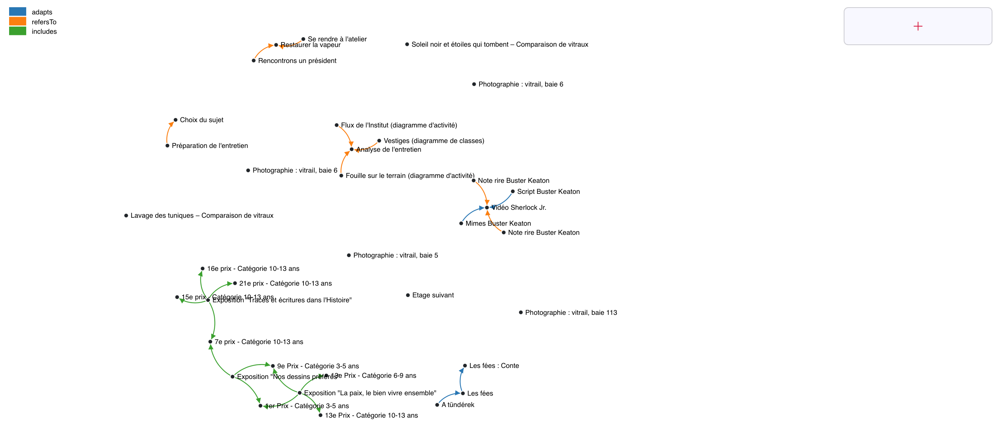
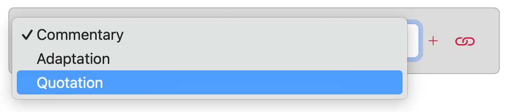

# Components structure

Hyperglosae frontend is composed of the following React components:

## Bookshelf

Source: [routes/Bookshelf.jsx](https://github.com/Hypertopic/HyperGlosae/blob/main/frontend/src/routes/Bookshelf.jsx)

Parts:

- Graph
- [FutureDocument](#futuredocument)

## Lectern

Source: [routes/Lectern.jsx](https://github.com/Hypertopic/HyperGlosae/blob/main/frontend/src/routes/Lectern.jsx)

Parts:

- [DocumentsCards](#documentscards)
- [OpenedDocuments](#openeddocuments)

## DocumentsCards

Source: [components/DocumentsCards.jsx](https://github.com/Hypertopic/HyperGlosae/blob/main/frontend/src/components/DocumentsCards.jsx)

Parts:

- [BrowseTools](#browsetools)
- [Metadata](#metadata)
- TypeBadge
- [FutureDocument](#futuredocument)

## OpenedDocuments

Source: [components/OpenedDocuments.jsx](https://github.com/Hypertopic/HyperGlosae/blob/main/frontend/src/components/OpenedDocuments.jsx)

Parts:

- [BrowseTools](#browsetools)
- [Metadata](#metadata)
- TypeBadge
- Type
- [Passage](#passage)

## BrowseTools

Source: [components/BrowseTools.jsx](https://github.com/Hypertopic/HyperGlosae/blob/main/frontend/src/components/BrowseTools.jsx)

Parts: **none**

## Metadata

Source: [components/Metadata.jsx](https://github.com/Hypertopic/HyperGlosae/blob/main/frontend/src/components/Metadata.jsx)

Parts: **none**

## FutureDocument

Source: [components/FutureDocument.jsx](https://github.com/Hypertopic/HyperGlosae/blob/main/frontend/src/components/FutureDocument.jsx)

Parts: **none**

## Passage

Source: [components/Passage.jsx](https://github.com/Hypertopic/HyperGlosae/blob/main/frontend/src/components/Passage.jsx)

Parts:

- [FormattedText](#formattedtext)
- [EditableText](#editabletext)

## FormattedText

Source: [components/FormattedText.jsx](https://github.com/Hypertopic/HyperGlosae/blob/main/frontend/src/components/FormattedText.jsx)

Parts:

- [EditableText](#editabletext)

## EditableText

Source: [components/EditableText.jsx](https://github.com/Hypertopic/HyperGlosae/blob/main/frontend/src/components/EditableText.jsx)

Parts:

- [CroppedImage](#croppedimage)
- [VideoComment](#videocomment)

## CroppedImage

Source: [components/CroppedImage.jsx](https://github.com/Hypertopic/HyperGlosae/blob/main/frontend/src/components/CroppedImage.jsx)

Parts: **none**

## VideoCommment

Source: [components/VideoComment.jsx](https://github.com/Hypertopic/HyperGlosae/blob/main/frontend/src/components/VideoComment.jsx)

Parts: **none**
